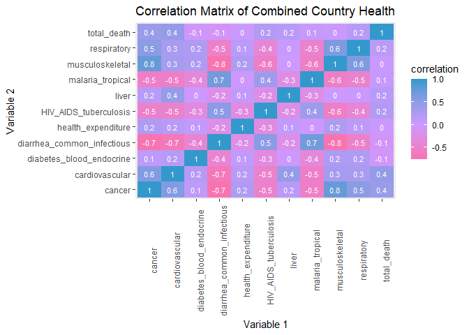
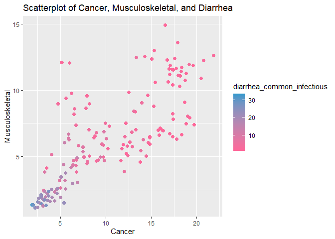
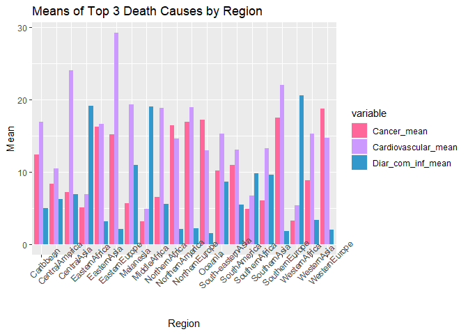
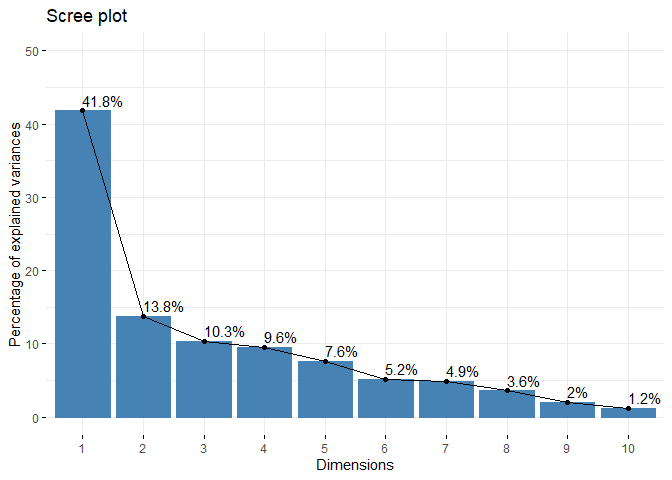
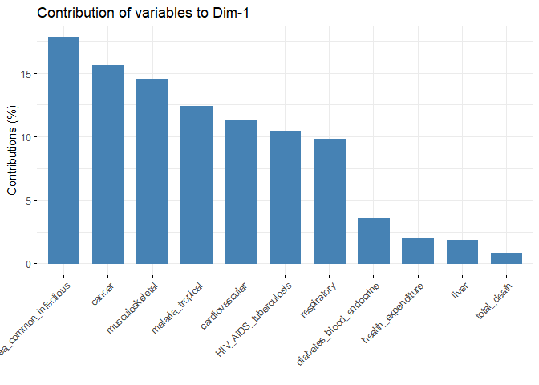

Health by Country
================
Cloie Angel Campos
3/17/2021

## Introduction

There were two data sets merged in this project, and both were taken
from the website kaggle. The first data set, “Country Statistics
-UNData”, contains 70 variables falling into the four major categories
of general information, economic indicators, social indicators, and
environmental & infrastructure indicators. This cleaned up data set was
taken from UNData website. At its original source, the data is collected
from several international statistical sources such as the Statistics
Division and the Population Division of the United Nations, the
statistical services of the United Nations, specialized agencies, etc.
For the purpose of this data analysis, only three variables will be
taken: country, region, and total expenditure on health in % of GDP. The
second dataset, “country health indicators”, is a previously tidied
dataset organized by country. It contains data regarding Covid-19 cases
and deaths, causes of death, food sources, vaccination rates, and
general information about the country. For the purpose of this
experiment, the causes of death variables organized by disease will be
taken from the dataset.

As a biology major with interest in becoming a doctor, I’m interested in
seeing the distribution of disease across the world and how this may be
influenced by region and expenditure on health.

I expect a negative correlation between health expenditure and the
percent DALY, “disability-adjusted life years”. This variable serves as
a measure of the burden of a disease in terms of how many years were
spent living with the disease and the years lost due to premature death.

## Cleaning up “Country Statistics - UNData”

``` r
#importing the dataset
countrystats <- read.csv("C:/Users/cloie/Downloads/country_profile_variables.csv", header = TRUE)

#taking only the variables I need
library(tidyverse)
```

    ## -- Attaching packages --------------------------------------- tidyverse 1.3.0 --

    ## v ggplot2 3.3.3     v purrr   0.3.4
    ## v tibble  3.1.0     v dplyr   1.0.5
    ## v tidyr   1.1.3     v stringr 1.4.0
    ## v readr   1.4.0     v forcats 0.5.1

    ## -- Conflicts ------------------------------------------ tidyverse_conflicts() --
    ## x dplyr::filter() masks stats::filter()
    ## x dplyr::lag()    masks stats::lag()

``` r
countrystats1 <- countrystats %>% select("country", "Region", "Health..Total.expenditure....of.GDP.")
#renaming long variable
countrystats1 <- countrystats1 %>% rename(health_expenditure = Health..Total.expenditure....of.GDP.)
#removing cases that don't include expenditure
countrystats1 <- countrystats1 %>% filter(!is.na(health_expenditure))
```

Overall, no variables needed to be tidied via rearranging or the
formation of new variables. The data set was just shortened to include
only the variables of interest, and the long variable name was
shortened. Also, I attempted to remove any rows that did not have data
on health expenditure, as it is one of the key variables I want to find
a relationship in, but none of the rows lacked this data.

## Cleaning up “country health indicators”

``` r
#importing the dataset
countryhealth <- read.csv("C:/Users/cloie/Downloads/country_health_indicators_v3.csv", header = TRUE)

#taking only the variables I need
countryhealth1 <- countryhealth %>% select("Country_Region", "Cardiovascular.diseases....":"Malaria...neglected.tropical.diseases....")

#renaming long variables and country
countryhealth1 <- countryhealth1 %>% rename(country = Country_Region, cancer = Cancers...., cardiovascular = Cardiovascular.diseases...., diabetes_blood_endocrine = Diabetes..blood....endocrine.diseases...., respiratory = Respiratory.diseases...., liver = Liver.disease...., diarrhea_common_infectious = Diarrhea...common.infectious.diseases...., musculoskeletal = Musculoskeletal.disorders...., HIV_AIDS_tuberculosis = HIV.AIDS.and.tuberculosis...., malaria_tropical = Malaria...neglected.tropical.diseases....)

#removing cases that have no data for causes of death
countryhealth1 <- countryhealth1 %>% drop_na(cardiovascular)
```

Overall, no variables needed to be tidied via rearranging or the
formation of new variables. The data set was just shortened to include
only the variables of interest, and the long variable names were
shortened. The rows lacking data on the different diseases were removed,
as as it is one of the key variables I want to find a relationship in,
and this removed 15 cases from the data set.

## Merging the Data Sets

``` r
#viewing mismatches from each dataset to check for different naming
countryhealth1 %>% anti_join(countrystats1, by = "country") %>% select(country)
```

    ##            country
    ## 1          Bolivia
    ## 2           Brunei
    ## 3    Cote d'Ivoire
    ## 4             Iran
    ## 5     Korea, South
    ## 6             Laos
    ## 7          Moldova
    ## 8  North Macedonia
    ## 9           Russia
    ## 10           Syria
    ## 11         Taiwan*
    ## 12        Tanzania
    ## 13              US
    ## 14       Venezuela
    ## 15         Vietnam

``` r
countrystats1 %>% anti_join(countryhealth1, by = "country") %>% select(country)
```

    ##                                      country
    ## 1                             American Samoa
    ## 2                                   Anguilla
    ## 3                                      Aruba
    ## 4                                    Bermuda
    ## 5           Bolivia (Plurinational State of)
    ## 6           Bonaire, Sint Eustatius and Saba
    ## 7                     British Virgin Islands
    ## 8                          Brunei Darussalam
    ## 9                                 Cabo Verde
    ## 10                            Cayman Islands
    ## 11                           Channel Islands
    ## 12                      China, Hong Kong SAR
    ## 13                          China, Macao SAR
    ## 14                                   Comoros
    ## 15                                     Congo
    ## 16                              Cook Islands
    ## 17     Democratic People's Republic of Korea
    ## 18          Democratic Republic of the Congo
    ## 19               Falkland Islands (Malvinas)
    ## 20                             Faroe Islands
    ## 21                             French Guiana
    ## 22                          French Polynesia
    ## 23                                 Gibraltar
    ## 24                                 Greenland
    ## 25                                Guadeloupe
    ## 26                                      Guam
    ## 27                                  Holy See
    ## 28                Iran (Islamic Republic of)
    ## 29                               Isle of Man
    ## 30                                  Kiribati
    ## 31          Lao People's Democratic Republic
    ## 32                                   Lesotho
    ## 33                             Liechtenstein
    ## 34                                    Malawi
    ## 35                          Marshall Islands
    ## 36                                Martinique
    ## 37                                   Mayotte
    ## 38          Micronesia (Federated States of)
    ## 39                                    Monaco
    ## 40                                Montserrat
    ## 41                                   Myanmar
    ## 42                                     Nauru
    ## 43                             New Caledonia
    ## 44                                      Niue
    ## 45                  Northern Mariana Islands
    ## 46                                     Palau
    ## 47                               Puerto Rico
    ## 48                         Republic of Korea
    ## 49                       Republic of Moldova
    ## 50                        Russian Federation
    ## 51                              Saint Helena
    ## 52                     Saint Kitts and Nevis
    ## 53                 Saint Pierre and Miquelon
    ## 54                                     Samoa
    ## 55                                San Marino
    ## 56                     Sao Tome and Principe
    ## 57                 Sint Maarten (Dutch part)
    ## 58                           Solomon Islands
    ## 59                               South Sudan
    ## 60                        State of Palestine
    ## 61                                 Swaziland
    ## 62                      Syrian Arab Republic
    ## 63                                Tajikistan
    ## 64 The former Yugoslav Republic of Macedonia
    ## 65                               Timor-Leste
    ## 66                                   Tokelau
    ## 67                                     Tonga
    ## 68                              Turkmenistan
    ## 69                  Turks and Caicos Islands
    ## 70                                    Tuvalu
    ## 71               United Republic of Tanzania
    ## 72                  United States of America
    ## 73              United States Virgin Islands
    ## 74                                   Vanuatu
    ## 75        Venezuela (Bolivarian Republic of)
    ## 76                                  Viet Nam
    ## 77                 Wallis and Futuna Islands
    ## 78                            Western Sahara
    ## 79                                     Yemen

``` r
#rename mismatches
countrystats1$country[countrystats1$country=="Bolivia (Plurinational State of)"] <- "Bolivia"
countrystats1$country[countrystats1$country=="Iran (Islamic Republic of)"] <- "Iran"
countrystats1$country[countrystats1$country=="Brunei Darussalam"] <- "Brunei"
countrystats1$country[countrystats1$country=="Republic of Korea"] <- "Korea, South"
countrystats1$country[countrystats1$country=="Lao People's Democratic Republic"] <- "Laos"
countrystats1$country[countrystats1$country=="Republic of Moldova"] <- "Moldova"
countrystats1$country[countrystats1$country=="The former Yugoslav Republic of Macedonia"] <- "North Macedonia"
countrystats1$country[countrystats1$country=="Russian Federation"] <- "Russia"
countrystats1$country[countrystats1$country=="Syrian Arab Republic"] <- "Syria"
countrystats1$country[countrystats1$country=="United Republic of Tanzania"] <- "Tanzania"
countrystats1$country[countrystats1$country=="United States of America"] <- "US"
countrystats1$country[countrystats1$country=="Venezuela (Bolivarian Republic of)"] <- "Venezuela"
countrystats1$country[countrystats1$country=="Viet Nam"] <- "Vietnam"
#combining the 2 data sets
countrycombine <- countryhealth1 %>% left_join(countrystats1, by = "country")
#removing incomplete cases
countrycombine <- countrycombine %>% na.omit()
```

First, anti-join was used in both directions to check if there were
mismatches due to different naming. After fixing the names, left-join
was used to ensure every data point had information on the different
diseases. From the “Country Health Indicators” data set, only Cote
d’Ivoire and Taiwan did not have a complete case after the renaming. As
such, these two were dropped from the full data set to maintain complete
cases. The cleaned, joined dataset contained 163 observations of 12
variables.

## Calculating Summary Statistics

``` r
# find how many countries spend over 10 percent of GDP
countrycombine %>% select(country, health_expenditure) %>% filter(health_expenditure > 10) %>% arrange(desc(health_expenditure))
```

    ##         country health_expenditure
    ## 1            US               17.1
    ## 2      Maldives               13.7
    ## 3        Sweden               11.9
    ## 4   Switzerland               11.7
    ## 5        France               11.5
    ## 6       Germany               11.3
    ## 7       Austria               11.2
    ## 8          Cuba               11.1
    ## 9  Sierra Leone               11.1
    ## 10  New Zealand               11.0
    ## 11  Netherlands               10.9
    ## 12      Denmark               10.8
    ## 13      Belgium               10.6
    ## 14     Djibouti               10.6
    ## 15       Canada               10.4
    ## 16       Serbia               10.4
    ## 17      Moldova               10.3
    ## 18        Japan               10.2

``` r
#general sum of death cause rates
countrycombine <- countrycombine %>% mutate(total_death = cardiovascular+cancer+diabetes_blood_endocrine+ respiratory+liver+diarrhea_common_infectious+ musculoskeletal+HIV_AIDS_tuberculosis+malaria_tropical)
  
# summary stats of numerical variables
countrycombine %>% select (-Region) %>% summarise(mean(cardiovascular), sd(cardiovascular), mean(cancer), sd(cancer), mean(diabetes_blood_endocrine), sd(diabetes_blood_endocrine), mean(respiratory), sd(respiratory), mean(liver), sd(liver), mean(diarrhea_common_infectious), sd(diarrhea_common_infectious), mean(musculoskeletal), sd(musculoskeletal), mean(HIV_AIDS_tuberculosis), sd(HIV_AIDS_tuberculosis), mean(malaria_tropical), sd(malaria_tropical), mean(health_expenditure), sd(health_expenditure))
```

    ##   mean(cardiovascular) sd(cardiovascular) mean(cancer) sd(cancer)
    ## 1              14.6699           7.626227     10.28256   5.615664
    ##   mean(diabetes_blood_endocrine) sd(diabetes_blood_endocrine) mean(respiratory)
    ## 1                       6.535173                     3.317604          3.363535
    ##   sd(respiratory) mean(liver) sd(liver) mean(diarrhea_common_infectious)
    ## 1        1.429406    1.622512 0.9886924                         7.922044
    ##   sd(diarrhea_common_infectious) mean(musculoskeletal) sd(musculoskeletal)
    ## 1                       7.565722              6.404306            3.475534
    ##   mean(HIV_AIDS_tuberculosis) sd(HIV_AIDS_tuberculosis) mean(malaria_tropical)
    ## 1                    3.681607                   6.34915               2.026722
    ##   sd(malaria_tropical) mean(health_expenditure) sd(health_expenditure)
    ## 1             4.207243                 5.441104               11.94491

``` r
# summary stats of new numerical variable
countrycombine %>% select (country, total_death) %>% summarise(mean(total_death), sd(total_death))
```

    ##   mean(total_death) sd(total_death)
    ## 1          56.50835        6.824163

``` r
# correlation matrix of numeric variables
countrycombine_num <- countrycombine %>% select_if(is.numeric)
```

I was interested in seeing which countries spent over 10% of their GDP
on healthcare, and there were 18 countries, with US surprisingly as the
top spender. I created the variable “total\_death” to sum up the
contribution of these top causes of death.

## Calculating Summary Statistics by Region

``` r
#summary stats after grouping by region
sumstatsregion <- countrycombine %>% group_by(Region) %>% summarise(mean(cardiovascular), mean(cancer), mean(diarrhea_common_infectious), mean(health_expenditure))

#renaming variables
sumstatsregion <- sumstatsregion %>%
rename("Cardiovascular_mean" = "mean(cardiovascular)", "Cancer_mean" = "mean(cancer)", "Diar_com_inf_mean" = "mean(diarrhea_common_infectious)", "Health_Expenditure_mean" = "mean(health_expenditure)")
```

## Summary Statistics as Tables

``` r
# creating data frame with overall summary stats
sumstats <- data.frame("Variable" = c("cardiovascular", "cancer", "diabetes_blood_endocrine", "respiratory", "liver", "diarrhea_common_infectious", "muscoloskeletal", "HIV_AIDS_tuberculosis", "malaria_tropical", "health_expenditure", "total_death"), "Mean" = c(14.6699, 10.28256, 6.535173, 3.363535, 1.622512, 7.922044, 6.404306, 3.681607, 2.026722, 5.441104, 56.50835), "Standard_deviation" = c(7.626227, 5.615664, 3.317604, 1.429406, 0.9886924, 7.565722, 3.475534, 6.34915, 4.207243, 11.94491, 6.824163))
#load table library
library(kableExtra)
```

    ## 
    ## Attaching package: 'kableExtra'

    ## The following object is masked from 'package:dplyr':
    ## 
    ##     group_rows

``` r
#make neat table of overall summary stats
kbl(sumstats, caption = "Table 1. Overall Summary Statistics") %>%
  kable_paper(bootstrap_options = "striped", full_width = F, position = "center")
```

<table class=" lightable-paper" style="font-family: &quot;Arial Narrow&quot;, arial, helvetica, sans-serif; width: auto !important; margin-left: auto; margin-right: auto;">
<caption>
Table 1. Overall Summary Statistics
</caption>
<thead>
<tr>
<th style="text-align:left;">
Variable
</th>
<th style="text-align:right;">
Mean
</th>
<th style="text-align:right;">
Standard\_deviation
</th>
</tr>
</thead>
<tbody>
<tr>
<td style="text-align:left;">
cardiovascular
</td>
<td style="text-align:right;">
14.669900
</td>
<td style="text-align:right;">
7.6262270
</td>
</tr>
<tr>
<td style="text-align:left;">
cancer
</td>
<td style="text-align:right;">
10.282560
</td>
<td style="text-align:right;">
5.6156640
</td>
</tr>
<tr>
<td style="text-align:left;">
diabetes\_blood\_endocrine
</td>
<td style="text-align:right;">
6.535173
</td>
<td style="text-align:right;">
3.3176040
</td>
</tr>
<tr>
<td style="text-align:left;">
respiratory
</td>
<td style="text-align:right;">
3.363535
</td>
<td style="text-align:right;">
1.4294060
</td>
</tr>
<tr>
<td style="text-align:left;">
liver
</td>
<td style="text-align:right;">
1.622512
</td>
<td style="text-align:right;">
0.9886924
</td>
</tr>
<tr>
<td style="text-align:left;">
diarrhea\_common\_infectious
</td>
<td style="text-align:right;">
7.922044
</td>
<td style="text-align:right;">
7.5657220
</td>
</tr>
<tr>
<td style="text-align:left;">
muscoloskeletal
</td>
<td style="text-align:right;">
6.404306
</td>
<td style="text-align:right;">
3.4755340
</td>
</tr>
<tr>
<td style="text-align:left;">
HIV\_AIDS\_tuberculosis
</td>
<td style="text-align:right;">
3.681607
</td>
<td style="text-align:right;">
6.3491500
</td>
</tr>
<tr>
<td style="text-align:left;">
malaria\_tropical
</td>
<td style="text-align:right;">
2.026722
</td>
<td style="text-align:right;">
4.2072430
</td>
</tr>
<tr>
<td style="text-align:left;">
health\_expenditure
</td>
<td style="text-align:right;">
5.441104
</td>
<td style="text-align:right;">
11.9449100
</td>
</tr>
<tr>
<td style="text-align:left;">
total\_death
</td>
<td style="text-align:right;">
56.508350
</td>
<td style="text-align:right;">
6.8241630
</td>
</tr>
</tbody>
</table>

``` r
#neat table of summary stats by region
kbl(sumstatsregion, caption = "Table 2. Summary Statistics by Region") %>%
  kable_paper(bootstrap_options = "striped", full_width = F, position = "center")
```

<table class=" lightable-paper" style="font-family: &quot;Arial Narrow&quot;, arial, helvetica, sans-serif; width: auto !important; margin-left: auto; margin-right: auto;">
<caption>
Table 2. Summary Statistics by Region
</caption>
<thead>
<tr>
<th style="text-align:left;">
Region
</th>
<th style="text-align:right;">
Cardiovascular\_mean
</th>
<th style="text-align:right;">
Cancer\_mean
</th>
<th style="text-align:right;">
Diar\_com\_inf\_mean
</th>
<th style="text-align:right;">
Health\_Expenditure\_mean
</th>
</tr>
</thead>
<tbody>
<tr>
<td style="text-align:left;">
Caribbean
</td>
<td style="text-align:right;">
16.907380
</td>
<td style="text-align:right;">
12.379859
</td>
<td style="text-align:right;">
5.026914
</td>
<td style="text-align:right;">
6.833333
</td>
</tr>
<tr>
<td style="text-align:left;">
CentralAmerica
</td>
<td style="text-align:right;">
10.516181
</td>
<td style="text-align:right;">
8.334675
</td>
<td style="text-align:right;">
6.227503
</td>
<td style="text-align:right;">
7.512500
</td>
</tr>
<tr>
<td style="text-align:left;">
CentralAsia
</td>
<td style="text-align:right;">
24.052259
</td>
<td style="text-align:right;">
7.266505
</td>
<td style="text-align:right;">
6.883647
</td>
<td style="text-align:right;">
5.566667
</td>
</tr>
<tr>
<td style="text-align:left;">
EasternAfrica
</td>
<td style="text-align:right;">
6.933349
</td>
<td style="text-align:right;">
5.116852
</td>
<td style="text-align:right;">
19.148986
</td>
<td style="text-align:right;">
-1.166667
</td>
</tr>
<tr>
<td style="text-align:left;">
EasternAsia
</td>
<td style="text-align:right;">
16.623815
</td>
<td style="text-align:right;">
16.233210
</td>
<td style="text-align:right;">
3.209013
</td>
<td style="text-align:right;">
6.950000
</td>
</tr>
<tr>
<td style="text-align:left;">
EasternEurope
</td>
<td style="text-align:right;">
29.184956
</td>
<td style="text-align:right;">
15.150208
</td>
<td style="text-align:right;">
2.140246
</td>
<td style="text-align:right;">
7.350000
</td>
</tr>
<tr>
<td style="text-align:left;">
Melanesia
</td>
<td style="text-align:right;">
19.285573
</td>
<td style="text-align:right;">
5.658848
</td>
<td style="text-align:right;">
10.982979
</td>
<td style="text-align:right;">
4.400000
</td>
</tr>
<tr>
<td style="text-align:left;">
MiddleAfrica
</td>
<td style="text-align:right;">
4.879050
</td>
<td style="text-align:right;">
3.222931
</td>
<td style="text-align:right;">
19.068999
</td>
<td style="text-align:right;">
3.733333
</td>
</tr>
<tr>
<td style="text-align:left;">
NorthernAfrica
</td>
<td style="text-align:right;">
18.809637
</td>
<td style="text-align:right;">
6.548956
</td>
<td style="text-align:right;">
5.605873
</td>
<td style="text-align:right;">
6.516667
</td>
</tr>
<tr>
<td style="text-align:left;">
NorthernAmerica
</td>
<td style="text-align:right;">
14.585898
</td>
<td style="text-align:right;">
16.450092
</td>
<td style="text-align:right;">
2.103158
</td>
<td style="text-align:right;">
13.750000
</td>
</tr>
<tr>
<td style="text-align:left;">
NorthernEurope
</td>
<td style="text-align:right;">
18.969115
</td>
<td style="text-align:right;">
16.875338
</td>
<td style="text-align:right;">
2.188125
</td>
<td style="text-align:right;">
8.680000
</td>
</tr>
<tr>
<td style="text-align:left;">
Oceania
</td>
<td style="text-align:right;">
12.995118
</td>
<td style="text-align:right;">
17.174066
</td>
<td style="text-align:right;">
1.522499
</td>
<td style="text-align:right;">
10.200000
</td>
</tr>
<tr>
<td style="text-align:left;">
South-easternAsia
</td>
<td style="text-align:right;">
15.267268
</td>
<td style="text-align:right;">
10.220778
</td>
<td style="text-align:right;">
8.613470
</td>
<td style="text-align:right;">
4.222222
</td>
</tr>
<tr>
<td style="text-align:left;">
SouthAmerica
</td>
<td style="text-align:right;">
13.115800
</td>
<td style="text-align:right;">
10.918533
</td>
<td style="text-align:right;">
5.510072
</td>
<td style="text-align:right;">
6.975000
</td>
</tr>
<tr>
<td style="text-align:left;">
SouthernAfrica
</td>
<td style="text-align:right;">
6.719184
</td>
<td style="text-align:right;">
4.882183
</td>
<td style="text-align:right;">
9.765414
</td>
<td style="text-align:right;">
-28.266667
</td>
</tr>
<tr>
<td style="text-align:left;">
SouthernAsia
</td>
<td style="text-align:right;">
13.281616
</td>
<td style="text-align:right;">
6.110411
</td>
<td style="text-align:right;">
9.665513
</td>
<td style="text-align:right;">
5.822222
</td>
</tr>
<tr>
<td style="text-align:left;">
SouthernEurope
</td>
<td style="text-align:right;">
22.013203
</td>
<td style="text-align:right;">
17.542708
</td>
<td style="text-align:right;">
1.795196
</td>
<td style="text-align:right;">
8.415385
</td>
</tr>
<tr>
<td style="text-align:left;">
WesternAfrica
</td>
<td style="text-align:right;">
5.409600
</td>
<td style="text-align:right;">
3.302723
</td>
<td style="text-align:right;">
20.582828
</td>
<td style="text-align:right;">
5.942857
</td>
</tr>
<tr>
<td style="text-align:left;">
WesternAsia
</td>
<td style="text-align:right;">
15.278118
</td>
<td style="text-align:right;">
8.874997
</td>
<td style="text-align:right;">
3.375656
</td>
<td style="text-align:right;">
5.206250
</td>
</tr>
<tr>
<td style="text-align:left;">
WesternEurope
</td>
<td style="text-align:right;">
14.753389
</td>
<td style="text-align:right;">
18.705807
</td>
<td style="text-align:right;">
2.063233
</td>
<td style="text-align:right;">
10.585714
</td>
</tr>
</tbody>
</table>

Overall there was a wide range in % DALYs due to each disease type. The
top three causes of death based on mean % DALYs were grouped by region
in Table 2, and any associations from here were hard to pick out from
the table.

## Visualizations

``` r
cor(countrycombine_num, use = "pairwise.complete.obs") %>% as.data.frame %>% rownames_to_column %>% pivot_longer(-1, names_to = "other_var", values_to = "correlation") %>% ggplot(aes(rowname, other_var, fill=correlation)) + geom_tile()  + scale_fill_gradient2(low="#FF6699", mid="#CC99FF", high="#3399CC") + geom_text(aes(label=round(correlation,1)), color="white", size=3) + labs(title="Correlation Matrix of Combined Country Health", x="Variable 1", y="Variable 2") + theme(axis.text.x = element_text(angle=90)) #turn axis labels to be legible
```

<!-- -->

``` r
#plot of musculoskeletal and cancer by diarrhea_common_infectious
ggplot(data=countrycombine, aes(x=cancer, y= musculoskeletal, color= diarrhea_common_infectious)) + geom_point(size=2) + scale_color_gradient(low="#FF6699", high="#3399CC") + labs(title="Scatterplot of Cancer, Musculoskeletal, and Diarrhea", x="Cancer", y="Musculoskeletal")
```

<!-- -->

``` r
#reorganize summary statistics by region
regionsbp <- sumstatsregion %>% select(-Health_Expenditure_mean) %>% pivot_longer(cols = c(2:4), names_to = "variable", values_to = "mean")
#turn into barplot
ggplot(regionsbp, aes(x=Region, y=mean, fill=variable)) + geom_bar(stat="identity", position = position_dodge()) + theme(axis.text.x = element_text(angle=45)) + scale_fill_manual(values=c("#FF6699", "#CC99FF", "#3399CC")) + labs(title="Means of Top 3 Death Causes by Region", x="Region", y="Mean")
```

<!-- -->

A correlation matrix was made for all the numeric variables, and as seen
in the figure, most variables had little to no correlation, even
total\_death and health\_expenditure. This is likely due to the issue
being much more complex.

The apparent positive correlation between % DALYs due to cancer and %
DALYs due to musculoskeletal disease to further visualize this
relationship as well as the negative association of musculoskeletal
disease with diarrhea and ensure that there is not another interaction
taking place, which there appears not to be because of a lack of other
function patterns like curves, parabolas, etc.

The third figure, “Means of Top 3 Death Causes by Region” visualizes
grouping the causes by region. From this barplot, one can observe that
the contributions of each death cause varies extremely widely throughout
each region, but that cardiovascular disease is a consistent high
contributor in most of the regions.

\#PCA Analysis

``` r
#scale values
cc_nocat <- countrycombine_num %>% mutate_if(is.numeric, scale)
# PCA
pca <- cc_nocat %>% prcomp()
names(pca)
```

    ## [1] "sdev"     "rotation" "center"   "scale"    "x"

``` r
percent <- 100*(pca$sdev^2 / sum(pca$sdev^2))
percent
```

    ##  [1] 4.180238e+01 1.378485e+01 1.032708e+01 9.576152e+00 7.620101e+00
    ##  [6] 5.199514e+00 4.893960e+00 3.595649e+00 2.028281e+00 1.172032e+00
    ## [11] 5.365514e-30

``` r
#load library
library(factoextra)
```

    ## Welcome! Want to learn more? See two factoextra-related books at https://goo.gl/ve3WBa

``` r
#eigen values
get_eigenvalue(pca)
```

    ##          eigenvalue variance.percent cumulative.variance.percent
    ## Dim.1  4.598261e+00     4.180238e+01                    41.80238
    ## Dim.2  1.516334e+00     1.378485e+01                    55.58723
    ## Dim.3  1.135979e+00     1.032708e+01                    65.91431
    ## Dim.4  1.053377e+00     9.576152e+00                    75.49046
    ## Dim.5  8.382111e-01     7.620101e+00                    83.11056
    ## Dim.6  5.719465e-01     5.199514e+00                    88.31008
    ## Dim.7  5.383356e-01     4.893960e+00                    93.20404
    ## Dim.8  3.955213e-01     3.595649e+00                    96.79969
    ## Dim.9  2.231109e-01     2.028281e+00                    98.82797
    ## Dim.10 1.289235e-01     1.172032e+00                   100.00000
    ## Dim.11 5.902065e-31     5.365514e-30                   100.00000

``` r
#scree plot
fviz_eig(pca, addlabels = TRUE, ylim = c(0,50))
```

<!-- -->

``` r
#save as data frame
pca1<- as.data.frame(pca$x)
#visualize
fviz_contrib(pca, choice = "var")
```

<!-- -->

Using the scree plot, the “elbow” occurs at 2 PCs. In principal
component 1, the following diseases, in descending order, contribute the
most: diarrhea/common infectious, cancer, musculoskeletal,
malaria/tropical, cardiovascular, HIV/AIDS/tuberculosis, and respiratory
disease. The remaining diseases contribute negligible amounts to the
first principal component.

Overall, my original hypothesis that the % of the GDP spent on
healthcare had no correlation at all. Perhaps the data from these two
data sets did not provide enough information on such a complex topic,
such as how this money is actually allocated for “health”. Also, region
appears to influence the burden from each cause of death. While
cardiovascular disease consistently has a large impact, % DALY due to
diarrhea/common infectious diseases fluctuates widely by region as shown
in the barplot.

## References:

“Country Statistics - UNData” source:
<https://www.kaggle.com/sudalairajkumar/undata-country-profiles>

“country health indicators” source:
<https://www.kaggle.com/nxpnsv/country-health-indicators>
