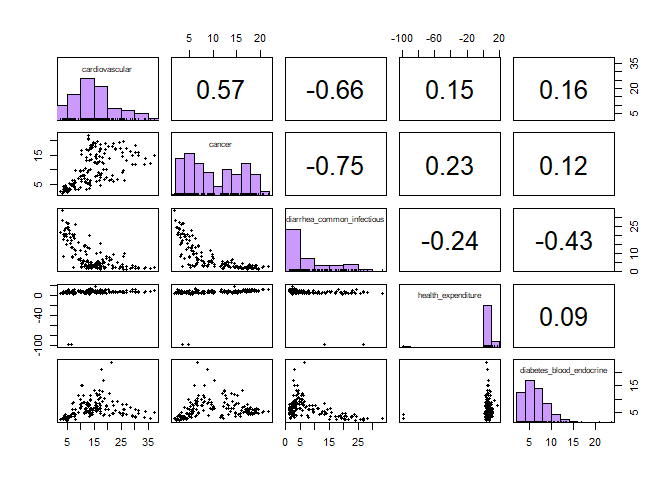
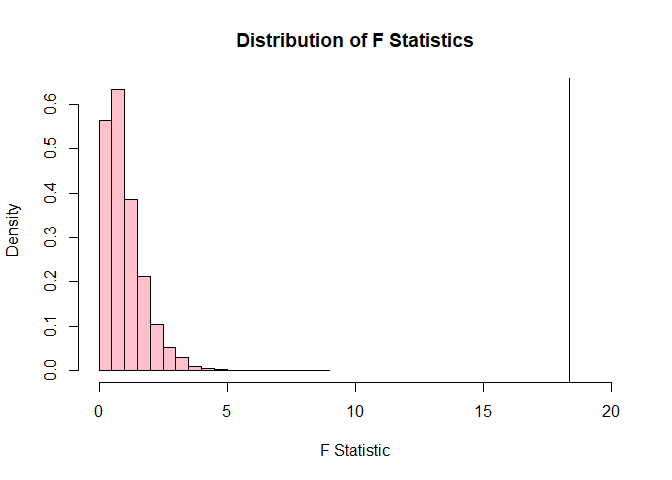
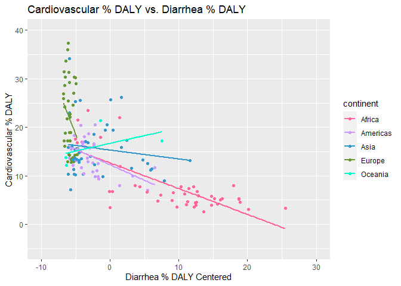
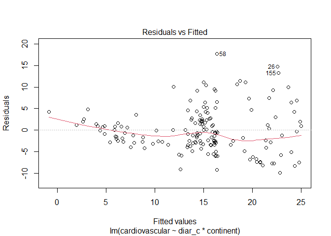
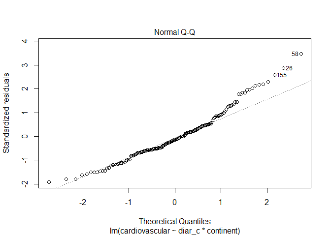
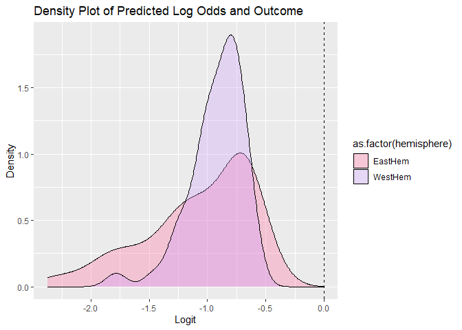
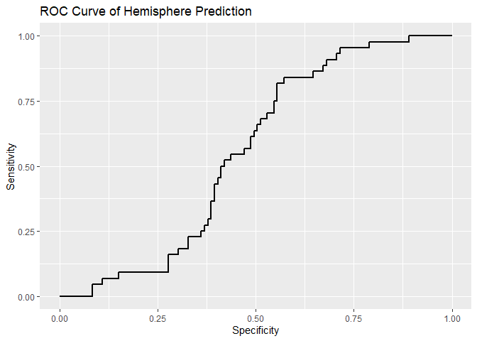

Health by Country Project 2
================
Cloie Angel Campos
4/15/2021

<style type="text/css">
  body{
  font-family: Trebuchet MS, sans-serif;
  font-size: 12pt;
}
</style>

## Introduction

There were two data sets merged in this project, and both were taken
from the website kaggle. The first data set, “Country Statistics
-UNData”, contains 70 variables falling into the four major categories
of general information, economic indicators, social indicators, and
environmental & infrastructure indicators. This cleaned up data set was
taken from UNData website. At its original source, the data is collected
from several international statistical sources such as the Statistics
Division and the Population Division of the United Nations, the
statistical services of the United Nations, specialized agencies, etc.
For the purpose of this data analysis, only three variables will be
taken: country, region, and total expenditure on health in % of GDP. The
second dataset, “country health indicators”, is a previously tidied
dataset organized by country. It contains data regarding Covid-19 cases
and deaths, causes of death, food sources, vaccination rates, and
general information about the country. For the purpose of this
experiment, the causes of death variables organized by disease will be
taken from the dataset.

The new dataset now has only 163 observations after only keeping
complete cases from the 229 in “Country Statistics -UNData” and the 180
in “country health indicators”.

The percent DALY, “disability-adjusted life years” variable serves as a
measure of the burden of a disease in terms of how many years were spent
living with the disease and the years lost due to premature death. The
percent dictates the length of “healthy” life lost in comparison to what
would be expected if the person did not have that disease, averaged for
each country.

As a biology major with interest in becoming a doctor, I’m interested in
seeing the distribution of disease across the world and how this may be
influenced by region and expenditure on health.

I was particularly interested in exploring differences in % DALY across
different regions or continents. I expect different regions to be
impacted on different levels (have different % DALYs) depending on the
disease. I also investigated how well a country’s hemisphere (East or
West) can be predicted based on the disease % DALYs.

``` r
# importing data set
countrycombined <- read.csv("C:/Users/cloie/Downloads/healthbycountry.csv", header = TRUE)
# removing column X (unnecessary column numbering each observation)
library(tidyverse)
```

    ## -- Attaching packages --------------------------------------- tidyverse 1.3.0 --

    ## v ggplot2 3.3.3     v purrr   0.3.4
    ## v tibble  3.1.0     v dplyr   1.0.5
    ## v tidyr   1.1.3     v stringr 1.4.0
    ## v readr   1.4.0     v forcats 0.5.1

    ## -- Conflicts ------------------------------------------ tidyverse_conflicts() --
    ## x dplyr::filter() masks stats::filter()
    ## x dplyr::lag()    masks stats::lag()

``` r
countrycombined <- countrycombined %>% select(-X)
```

For the most part, the data was already completely tidy. However,
importing the set included a new column titled “X” that just numbered
each observation, so it was removed. Now, there are 163 observations of
12 variables (2 categorical, 10 numerical).

## EDA

``` r
# find means DALY of diseases to find top 4 causes
countrycombined %>% summarise(mean(cardiovascular), mean(cancer), mean(diabetes_blood_endocrine), mean(respiratory), mean(liver), mean(diarrhea_common_infectious), mean(musculoskeletal), mean(HIV_AIDS_tuberculosis), mean(malaria_tropical), mean(health_expenditure))
```

    ##   mean(cardiovascular) mean(cancer) mean(diabetes_blood_endocrine)
    ## 1              14.6699     10.28256                       6.535173
    ##   mean(respiratory) mean(liver) mean(diarrhea_common_infectious)
    ## 1          3.363535    1.622512                         7.922044
    ##   mean(musculoskeletal) mean(HIV_AIDS_tuberculosis) mean(malaria_tropical)
    ## 1              6.404306                    3.681607               2.026722
    ##   mean(health_expenditure)
    ## 1                 5.441104

``` r
# correlation matrix of numeric variables of interest
countrycombined_num <- countrycombined %>% select(cardiovascular, cancer, diarrhea_common_infectious, health_expenditure, diabetes_blood_endocrine)
# load library
library(psych)
```

    ## 
    ## Attaching package: 'psych'

    ## The following objects are masked from 'package:ggplot2':
    ## 
    ##     %+%, alpha

``` r
# correlation for num variables w univariate and bivariate graphs
pairs.panels(countrycombined_num,
             method = "pearson",
             hist.col = "#CC99FF",
             smooth = FALSE, density = FALSE, ellipses=FALSE)
```

<!-- -->

From this correlation matrix, it can be seen that a lot of the
correlation coefficients are weak, and most of the univariate
distributions do not appear normal. It is unlikely that these
distributions will pass the assumptions for tests like the MANOVA. The
strongest correlation can be seen between cancer % DALY and infectious
disease % DALY; the correlation coefficient of -.75 indicates that as
one increases, the other tends to decrease. The next strongest
correlation is the correlation coefficient of -0.66 between infectious
disease % DALY and cardiovascular disease % DALY; as one increases, the
other tends to decrease as well. Another weak correlation is the 0.57
correlation coefficient between cancer % DALY and cardiovascular % DALY;
as one increases, the other tends to increase as well. However, the
other correlation coefficients of .15, .16, 0.23, 0.12, -.24, -.43, and
0.09 indicate little to no correlation between the variables.

## MANOVA

``` r
# number regions
length(unique(countrycombined$Region))
```

    ## [1] 20

``` r
# create continent variable to simplify predictor
library(countrycode)
countrycombined$continent <- countrycode(sourcevar = countrycombined[, "country"], origin = "country.name", destination = "continent")

# MANOVA test
manova_region <- manova(cbind(cardiovascular, cancer, diarrhea_common_infectious, health_expenditure) ~ continent, data = countrycombined)

# Output of MANOVA
summary(manova_region)
```

    ##            Df  Pillai approx F num Df den Df    Pr(>F)    
    ## continent   4 0.98083   12.832     16    632 < 2.2e-16 ***
    ## Residuals 158                                             
    ## ---
    ## Signif. codes:  0 '***' 0.001 '**' 0.01 '*' 0.05 '.' 0.1 ' ' 1

``` r
# one way ANOVA
summary.aov(manova_region)
```

    ##  Response cardiovascular :
    ##              Df Sum Sq Mean Sq F value    Pr(>F)    
    ## continent     4 4175.5  1043.9  31.438 < 2.2e-16 ***
    ## Residuals   158 5246.3    33.2                      
    ## ---
    ## Signif. codes:  0 '***' 0.001 '**' 0.01 '*' 0.05 '.' 0.1 ' ' 1
    ## 
    ##  Response cancer :
    ##              Df Sum Sq Mean Sq F value    Pr(>F)    
    ## continent     4 3368.4  842.11  76.452 < 2.2e-16 ***
    ## Residuals   158 1740.4   11.01                      
    ## ---
    ## Signif. codes:  0 '***' 0.001 '**' 0.01 '*' 0.05 '.' 0.1 ' ' 1
    ## 
    ##  Response diarrhea_common_infectious :
    ##              Df Sum Sq Mean Sq F value    Pr(>F)    
    ## continent     4 5475.6 1368.89  56.957 < 2.2e-16 ***
    ## Residuals   158 3797.3   24.03                      
    ## ---
    ## Signif. codes:  0 '***' 0.001 '**' 0.01 '*' 0.05 '.' 0.1 ' ' 1
    ## 
    ##  Response health_expenditure :
    ##              Df  Sum Sq Mean Sq F value  Pr(>F)  
    ## continent     4  1431.6  357.90   2.608 0.03773 *
    ## Residuals   158 21682.7  137.23                  
    ## ---
    ## Signif. codes:  0 '***' 0.001 '**' 0.01 '*' 0.05 '.' 0.1 ' ' 1

From the means DALY%, the top three disease-causes of death are cancer,
cardiovascular diseases, and diarrhea/common infectious diseases. The
purpose of the MANOVA was to try to check if there are significant
differences in the means in health expenditure or the top three causes
of death when grouped by region. Only the top three were used because
there were too many numerical variables, in which significance in each
one-way ANOVA would require too many post-hoc t-tests.

As shown by the code, there are 20 regions, and using regions made the
post-hoc t-tests pass the 30 page limit. Thus, the regions were further
simplified to just continents, and the MANOVA was attempted again.

The MANOVA was significant (p &lt; 0.0001), so a one-way ANOVA was
performed for each variable. The one-way ANOVA was significant for every
variable: cancer (p &lt; 0.0001), cardiovascular disease (p &lt;
0.0001), diarrhea/common infectious diseases (p &lt; 0.0001), and health
expenditure (p = 0.03773). This means that for all of these variables,
at least one continent has a significantly different mean from the other
continents in these variables. Thus, further post-hoc t-tests were
performed to identify which continents differ from one another.

*Post-Hoc T tests*

``` r
# For cancer
pairwise.t.test(countrycombined$cancer,countrycombined$continent, p.adj="none")
```

    ## 
    ##  Pairwise comparisons using t tests with pooled SD 
    ## 
    ## data:  countrycombined$cancer and countrycombined$continent 
    ## 
    ##          Africa  Americas Asia    Europe
    ## Americas 1.9e-15 -        -       -     
    ## Asia     8.6e-10 0.0107   -       -     
    ## Europe   < 2e-16 3.7e-12  < 2e-16 -     
    ## Oceania  9.2e-05 0.8802   0.1969  0.0017
    ## 
    ## P value adjustment method: none

``` r
# For cardiovascular
pairwise.t.test(countrycombined$cardiovascular,countrycombined$continent, p.adj="none")
```

    ## 
    ##  Pairwise comparisons using t tests with pooled SD 
    ## 
    ## data:  countrycombined$cardiovascular and countrycombined$continent 
    ## 
    ##          Africa  Americas Asia    Europe
    ## Americas 6.2e-06 -        -       -     
    ## Asia     3.4e-09 0.2101   -       -     
    ## Europe   < 2e-16 2.9e-08  3.4e-06 -     
    ## Oceania  0.0061  0.4689   0.8610  0.0641
    ## 
    ## P value adjustment method: none

``` r
# For diarrhea
pairwise.t.test(countrycombined$diarrhea_common_infectious,countrycombined$continent, p.adj="none")
```

    ## 
    ##  Pairwise comparisons using t tests with pooled SD 
    ## 
    ## data:  countrycombined$diarrhea_common_infectious and countrycombined$continent 
    ## 
    ##          Africa  Americas Asia    Europe 
    ## Americas < 2e-16 -        -       -      
    ## Asia     < 2e-16 0.46193  -       -      
    ## Europe   < 2e-16 0.00468  0.00022 -      
    ## Oceania  3.8e-05 0.71591  0.96707 0.10219
    ## 
    ## P value adjustment method: none

``` r
# For health expenditure
pairwise.t.test(countrycombined$health_expenditure,countrycombined$continent, p.adj="none")
```

    ## 
    ##  Pairwise comparisons using t tests with pooled SD 
    ## 
    ## data:  countrycombined$health_expenditure and countrycombined$continent 
    ## 
    ##          Africa Americas Asia   Europe
    ## Americas 0.0164 -        -      -     
    ## Asia     0.0885 0.4347   -      -     
    ## Europe   0.0033 0.6758   0.2105 -     
    ## Oceania  0.3019 0.9807   0.7476 0.8333
    ## 
    ## P value adjustment method: none

``` r
# Bonferroni correction
.05/(1+4+40)
```

    ## [1] 0.001111111

``` r
# probability of at least one type one error
1- (0.95^45)
```

    ## [1] 0.9005597

``` r
#amount in each continent
table(countrycombined$continent)
```

    ## 
    ##   Africa Americas     Asia   Europe  Oceania 
    ##       44       34       41       40        4

For the following interpretation, Bonferroni’s correction was used to
yield a new alpha value of .0011. Because there were 9 tests (1 MANOVA +
4 ANOVA + 40 t-tests), the probability of at least one type 1 error is
0.90.

For the mean impact of cancers, we reject that Africa has the same mean
% DALY as Asia (p&lt;0.0001), the Americas (p&lt;0.0001), Europe
(p&lt;0.0001), or Oceania (p&lt;0.0001). We also reject the the Americas
has the same mean % DALY as Europe (p&lt;0.0001). Lastly, we reject that
Asia has the same mean % DALY as Europe (p&lt;0.0001).

For the mean impact of cardiovascular diseases, we reject that Africa
has the same mean % DALY as Asia (p&lt;0.0001), the Americas
(p&lt;0.0001), or Europe (p&lt;0.0001). We also reject that the Americas
have the same mean % DALY as Europe (p&lt;0.0001). Lastly, we reject
that Asia has the same mean % DALY as Europe (p&lt;0.0001).

For the mean impact of diarrhea/common infectious diseases, we reject
that Africa has the same mean % DALY as Asia (p&lt;0.0001), the Americas
(p&lt;0.0001), Europe (p&lt;0.0001), or Oceania (p&lt;0.0001). Lastly,
we reject that Asia has the same mean % DALY as Europe (p=0.00022).

However, these results must be taken with it in mind that the
assumptions do not appear to be met. Based on the univariate graphs in
the EDA, few of the numerical variables have a normal distribution.
Based on how many countries are in each continent, with 44 in Africa and
only 4 in Oceania, it is unlikely that there is an equal variance across
each group either.

## Randomization Test

``` r
# Run ANOVA to compare the length by different doses
summary(aov(diabetes_blood_endocrine ~ continent, data = countrycombined))
```

    ##              Df Sum Sq Mean Sq F value   Pr(>F)    
    ## continent     4  565.9   141.5   18.37 2.07e-12 ***
    ## Residuals   158 1217.1     7.7                     
    ## ---
    ## Signif. codes:  0 '***' 0.001 '**' 0.01 '*' 0.05 '.' 0.1 ' ' 1

``` r
#pair-wise t-test to see which means differ
pairwise.t.test(countrycombined$diabetes_blood_endocrine, countrycombined$continent, p.adj = "none")
```

    ## 
    ##  Pairwise comparisons using t tests with pooled SD 
    ## 
    ## data:  countrycombined$diabetes_blood_endocrine and countrycombined$continent 
    ## 
    ##          Africa  Americas Asia    Europe 
    ## Americas 1.1e-11 -        -       -      
    ## Asia     5.1e-05 0.00114  -       -      
    ## Europe   0.46620 1.0e-09  0.00100 -      
    ## Oceania  0.00022 0.57180  0.04304 0.00070
    ## 
    ## P value adjustment method: none

``` r
#Bonferroni correction
.05/(1+10)
```

    ## [1] 0.004545455

``` r
# Observed F-statistic, running anova
obs_F <- 18.37

# Randomization test (using replicate)
Fs <- replicate(5000,{
  # Randomly permute the response variable across continents
  new <- countrycombined %>%
    mutate(diabetes_blood_endocrine = sample(diabetes_blood_endocrine))
  # Compute variation within groups
  SSW <- new %>%
    group_by(continent) %>%
    summarize(SSW = sum((diabetes_blood_endocrine - mean(diabetes_blood_endocrine))^2)) %>%
    summarize(sum(SSW)) %>% 
    pull
  # Compute variation between groups
  SSB <- new %>% 
    mutate(mean = mean(diabetes_blood_endocrine)) %>%
    group_by(continent) %>% 
    mutate(groupmean = mean(diabetes_blood_endocrine)) %>%
    summarize(SSB = sum((mean - groupmean)^2)) %>%
    summarize(sum(SSB)) %>%
    pull
  # Compute the F-statistic (ratio of MSB and MSW)
  # df for SSB is 5 groups - 1 = 4
  # df for SSW is 163 observations - 5 groups = 158
  (SSB/4)/(SSW/158)
})

# Represent the distribution of the F-statistics for each randomized sample
hist(Fs, prob=T,xlab="F Statistic", main="Distribution of F Statistics", col="pink", xlim=c(0, 20)); abline(v = obs_F, col="black")
```

<!-- -->

``` r
mean(Fs > obs_F)
```

    ## [1] 0

For this randomization test, the fourth highest cause of death,
diabetes/blood/endocrine disease % DALY was used. Ho: There is no
difference between the mean diabetes/blood/endocrine disease % DALY
across different continents. Ho: At least one continent has a different
mean diabetes/blood/endocrine disease % DALY from the other continents.
The results show that the F-statistic is greater than 1 (F = 18.37),
indicating that at least one mean diabetes/blood/endocrine disease %
DALY differs from the others. To see which ones differ, a pair-wise
t-test was used with Bonferroni’s correction of alpha = .0045 as the new
alpha value. From this, we reject that Africa has the same mean
diabetes/blood/endocrine disease % DALY as the Americas (p&lt;0.0001),
Asia(p&lt;0.0001), and Oceania (p=.00022). We also reject that the
Americas has the same mean as Asia (p=.00114) and Europe(p&lt;0.0001).
We also reject that the Asia has the same mean as Europe (p=.001). We
also reject that the Oceania has the same mean as Europe (p=.0007).

The calculated proportion of F-statistics that are greater than the
observed F-statistic is 0, which matches the p-value from the ANOVA test
(2e-12).

## Linear Regression Model

``` r
# centered the data around the means of numerical predictors
countrycombined$diar_c <- countrycombined$diarrhea_common_infectious - mean(countrycombined$diarrhea_common_infectious)

# interaction term in the regression model with centered predictors
fit_c <- lm(cardiovascular ~ diar_c * continent, data = countrycombined)
summary(fit_c)
```

    ## 
    ## Call:
    ## lm(formula = cardiovascular ~ diar_c * continent, data = countrycombined)
    ## 
    ## Residuals:
    ##     Min      1Q  Median      3Q     Max 
    ## -9.9366 -3.0684 -0.7007  2.4503 17.7475 
    ## 
    ## Coefficients:
    ##                          Estimate Std. Error t value Pr(>|t|)    
    ## (Intercept)               12.6431     1.2360  10.229  < 2e-16 ***
    ## diar_c                    -0.5302     0.1034  -5.127 8.79e-07 ***
    ## continentAmericas         -0.3869     1.7436  -0.222   0.8247    
    ## continentAsia              2.6393     1.5184   1.738   0.0842 .  
    ## continentEurope          -12.1886     8.9004  -1.369   0.1729    
    ## continentOceania           4.0257     2.9998   1.342   0.1816    
    ## diar_c:continentAmericas  -0.1097     0.3370  -0.326   0.7452    
    ## diar_c:continentAsia       0.3452     0.2109   1.637   0.1037    
    ## diar_c:continentEurope    -3.0862     1.4920  -2.068   0.0403 *  
    ## diar_c:continentOceania    0.8467     0.4722   1.793   0.0749 .  
    ## ---
    ## Signif. codes:  0 '***' 0.001 '**' 0.01 '*' 0.05 '.' 0.1 ' ' 1
    ## 
    ## Residual standard error: 5.246 on 153 degrees of freedom
    ## Multiple R-squared:  0.5531, Adjusted R-squared:  0.5269 
    ## F-statistic: 21.04 on 9 and 153 DF,  p-value: < 2.2e-16

``` r
# visualize relationship b/t all 3 variables
sp1 <- ggplot(countrycombined, aes(x = diar_c, y = cardiovascular, color = continent)) +
  geom_point() +
  geom_smooth(method=lm, se = F) + 
  xlim(-10,30) + ylim(-5,40) + 
  labs(title="Cardiovascular % DALY vs. Diarrhea % DALY", x="Diarrhea % DALY Centered", y="Cardiovascular % DALY")

# pretty scatter plot colors
sp1 + scale_color_manual(values=c("#FF6699", "#CC99FF", "#3399CC", "#669933", "#00FFCC"))
```

    ## `geom_smooth()` using formula 'y ~ x'

<!-- -->

``` r
#check for normality and equal variance with fitted vs residuals
plot(fit_c, which = 1)
```

<!-- -->

``` r
# Shapiro-Wilk test for normality
shapiro.test(fit_c$residuals)
```

    ## 
    ##  Shapiro-Wilk normality test
    ## 
    ## data:  fit_c$residuals
    ## W = 0.96214, p-value = 0.0002008

``` r
# QQ plot for normality of residuals
plot(fit_c, which = 2)
```

<!-- -->

``` r
# Robust Standard Errors
library(sandwich)
```

    ## Warning: package 'sandwich' was built under R version 4.0.5

``` r
library(lmtest)
```

    ## Loading required package: zoo

    ## 
    ## Attaching package: 'zoo'

    ## The following objects are masked from 'package:base':
    ## 
    ##     as.Date, as.Date.numeric

``` r
coeftest(fit_c, vcov = vcovHC(fit_c))
```

    ## 
    ## t test of coefficients:
    ## 
    ##                            Estimate Std. Error t value  Pr(>|t|)    
    ## (Intercept)               12.643095   1.344706  9.4021 < 2.2e-16 ***
    ## diar_c                    -0.530153   0.097795 -5.4211 2.262e-07 ***
    ## continentAmericas         -0.386949   1.598249 -0.2421   0.80902    
    ## continentAsia              2.639348   1.580660  1.6698   0.09701 .  
    ## continentEurope          -12.188590  12.317994 -0.9895   0.32398    
    ## continentOceania           4.025748   7.384573  0.5452   0.58644    
    ## diar_c:continentAmericas  -0.109709   0.244861 -0.4480   0.65475    
    ## diar_c:continentAsia       0.345227   0.197989  1.7437   0.08323 .  
    ## diar_c:continentEurope    -3.086222   2.046173 -1.5083   0.13354    
    ## diar_c:continentOceania    0.846750   1.362568  0.6214   0.53524    
    ## ---
    ## Signif. codes:  0 '***' 0.001 '**' 0.01 '*' 0.05 '.' 0.1 ' ' 1

The assumptions are not met. From the normal Q-Q plot, the residuals
appear either light-tailed or right-skewed, and the Shapiro-Wilk test
also indicates that the residuals are not normal (p=0.0002). In the
Residuals vs. Fitted plot, the residuals appear to have linearity
because there is an approximately equal amount of equal and negative
residuals throughout the plot, but the funneling indicates that the
residuals do not have equal variance.

An African country with an average diarrhea % DALY has a cardiovascular
disease % DALY of 12.6431%. A 1% increase in diarrhea % DALY from the
mean decreases cardiovascular disease % DALY decreases by 0.5302% in an
African country.

For a country in the Americas with an average diarrhea % DALY,
cardiovascular disease % DALY is 0.3869% less than an African country
with average diarrhea % DALY. For an Asian country with an average
diarrhea% DALY, cardiovascular disease % DALY is 2.6393% more than an
African country with average diarrhea % DALY. For a European country
with an average diarrhea % DALY, cardiovascular disease % DALY is
12.1186% less than an African country with average diarrhea % DALY. For
a country in Oceania with an average diarrhea % DALY, cardiovascular
disease % DALY is 4.0257% more than an African country with average
diarrhea % DALY.

For a country in the Americas, the slope of cardiovascular % DALY per
diarrhea % DALY decreases by .1097 compared to an an African country.
Diarrhea % DALY has a higher effect on cardiovascular % DALY on African
countries than countries in the Americas.

For an Asian country, the slope of cardiovascular % DALY per diarrhea %
DALY increases by .3452 compared to an an African country. Diarrhea %
DALY has a higher effect on cardiovascular % DALY on Asian countries
than African countries.

For a European country, the slope of cardiovascular % DALY per diarrhea
% DALY decreases by 3.0862 compared to an an African country. Diarrhea %
DALY has a higher effect on cardiovascular % DALY on African countries
than European countries.

For a country in Oceania, the slope of cardiovascular % DALY per
diarrhea % DALY increases by 0.8467 compared to an an African country.
Diarrhea % DALY has a higher effect on cardiovascular % DALY on
countries in Oceania than African countries.

The model explains 52.69% of the variation in response.

After recomputing with robust standard errors, all the coefficients are
the same. However, prior to having robust standard errors, there was a
significant effect of diarrhea % DALY on cardiovascular % DALY (p &lt;
0.0001) and a significant interaction of European countries on the
effect of diarrhea % DALY on cardiovascular % DALY compared to African
countries (p=0.04). With robust standard errors, there is still
significant effect of diarrhea % DALY on cardiovascular % DALY (p &lt;
0.0001) but there is no longer any significant interactions based on
continent.

*Linear Regression: Bootstrap*

``` r
set.seed(348)
#  Bootstrap from residuals
# Repeat bootstrapping 5000 times, saving the coefficients each time
resids_SEs <- replicate(5000, {
  # resample with replacement
  new_resids <- sample(fit_c$residuals, replace = TRUE)
  # Consider a new response as fitted values plus residuals
  boot_data <- countrycombined
  boot_data$new_y = fit_c$fitted.values + new_resids
  # Fit regression model
  fitboot <- lm(new_y ~ diar_c * continent, data = boot_data)
  # Save the coefficients
  coef(fitboot)
})

# Estimated SEs
resids_SEs %>%
  # Transpose the obtained matrices
  t %>%
  # Consider the matrix as a data frame
  as.data.frame %>%
  # Compute the standard error (standard deviation of the sampling distribution)
  summarize_all(sd)
```

    ##   (Intercept)    diar_c continentAmericas continentAsia continentEurope
    ## 1    1.188328 0.1000987          1.701424      1.474311        8.622427
    ##   continentOceania diar_c:continentAmericas diar_c:continentAsia
    ## 1         2.927507                0.3289081            0.2058532
    ##   diar_c:continentEurope diar_c:continentOceania
    ## 1               1.443384               0.4542612

The bootstrapped standard errors are just slightly smaller but
approximately the same as the original standard errors. The robust
standard errors are bigger than both the original and boot strapped
ones. Thus, the significance is probably the same for bootstrapped and
original results.

## Logistic Regression

``` r
#create binary variable
countrycombined <- countrycombined %>%
  mutate(y = ifelse(continent == "Americas", 1, 0))
#replace the European and African countries that are entirely in Western Hemisphere to be in 1 instead of 0
countrycombined$y <- as.character(countrycombined$y)  
countrycombined$y[countrycombined$country == "Iceland"] <- "1"
countrycombined$y[countrycombined$country == "Gambia"] <- "1"
countrycombined$y[countrycombined$country == "Guinea"] <- "1"
countrycombined$y[countrycombined$country == "Guinea-Bissau"] <- "1"
countrycombined$y[countrycombined$country == "Liberia"] <- "1"
countrycombined$y[countrycombined$country == "Mauritania"] <- "1"
countrycombined$y[countrycombined$country == "Morocco"] <- "1"
countrycombined$y[countrycombined$country == "Senegal"] <- "1"
countrycombined$y[countrycombined$country == "Sierra Leone"] <- "1"
countrycombined$y[countrycombined$country == "Ireland"] <- "1"

#create truth binary variable
countrycombined <- countrycombined %>%
  mutate(hemisphere = ifelse(y == "1", "WestHem", "EastHem"))

# convert back to numerical
countrycombined$y <- as.numeric(countrycombined$y)

# log regression model
fit_log <- glm(y ~ cancer + cardiovascular, data = countrycombined, family = binomial(link="logit"))
summary(fit_log)
```

    ## 
    ## Call:
    ## glm(formula = y ~ cancer + cardiovascular, family = binomial(link = "logit"), 
    ##     data = countrycombined)
    ## 
    ## Deviance Residuals: 
    ##     Min       1Q   Median       3Q      Max  
    ## -1.0126  -0.8799  -0.7109   1.4582   1.9693  
    ## 
    ## Coefficients:
    ##                Estimate Std. Error z value Pr(>|z|)  
    ## (Intercept)    -0.51313    0.41424  -1.239   0.2154  
    ## cancer          0.04442    0.03910   1.136   0.2559  
    ## cardiovascular -0.06676    0.03312  -2.015   0.0439 *
    ## ---
    ## Signif. codes:  0 '***' 0.001 '**' 0.01 '*' 0.05 '.' 0.1 ' ' 1
    ## 
    ## (Dispersion parameter for binomial family taken to be 1)
    ## 
    ##     Null deviance: 190.12  on 162  degrees of freedom
    ## Residual deviance: 185.51  on 160  degrees of freedom
    ## AIC: 191.51
    ## 
    ## Number of Fisher Scoring iterations: 4

``` r
# Interpret
exp(coef(fit_log))
```

    ##    (Intercept)         cancer cardiovascular 
    ##      0.5986167      1.0454261      0.9354201

``` r
# add predicted probabilities to the dataset
countrycombined$prob <- predict(fit_log, type = "response")

# adding predicted outcome based on the probability of West Hem
# if the probability is greater than 0.5, the country is in WH
countrycombined$predicted <- ifelse(countrycombined$prob > .5, "WestHem", "EastHem") 

# confusion matrix, 1 = west, 0 = east
table(truth = countrycombined$hemisphere, prediction = countrycombined$predicted)
```

    ##          prediction
    ## truth     EastHem
    ##   EastHem     119
    ##   WestHem      44

``` r
# accuracy (correctly classified cases)
119/163 
```

    ## [1] 0.7300613

``` r
# sensitivity (True Positive Rate, TPR)
0/44
```

    ## [1] 0

``` r
# specificity (True Negative Rate, TNR)
119/119
```

    ## [1] 1

``` r
# precision (Positive Predictive Value, PPV)
0
```

    ## [1] 0

The binary variable was split into countries divided by the Prime
Meridian. Because some countries are in both the Eastern and Western
Hemisphere, only countries entirely in the Western Hemisphere were added
to “1”.

Controlling for cardiovascular % DALY, every 1% increase in cancer %
DALY increases the log odds of being in the Western Hemisphere by 0.044.
Every 1% increase in cancer % DALY multiplies the odds of being in the
Western Hemisphere by 1.05 (i.e., the odds of being in the Western
Hemisphere increase by 5% for every additional cancer % DALY).

Controlling for cancer % DALY, every 1% increase in cardiovascular %
DALY decreases the log odds of being in the Western Hemisphere by 0.067.
Every 1% increase in cardiovascular % DALY multiplies the odds of being
in the Western Hemisphere by 0.94. (i.e., the odds of being in the
Western Hemisphere decrease by 6% for every additional cardiovascular %
DALY). This is a significant predictor.

The accuracy is 0.73. The sensitivity is 0. The specificity is 1. The
precision is 0.

## Logistic Regression Density Plot and ROC Plot

``` r
# save the predicted log-odds in the dataset
countrycombined$logit <- predict(fit_log)

# Compare to the outcome in the dataset with a density plot
dp <- ggplot(countrycombined, aes(logit, fill = as.factor(hemisphere))) +
  geom_density(alpha = .3) +
  geom_vline(xintercept = 0, lty = 2) +
  labs(title="Density Plot of Predicted Log Odds and Outcome", x="Logit", y="Density")

dp+scale_fill_manual(values=c("#FF6699", "#CC99FF"))
```

<!-- -->

``` r
# ROCplot
library(plotROC)
```

    ## Warning: package 'plotROC' was built under R version 4.0.5

``` r
ROCplot <- ggplot(countrycombined) + geom_roc(aes(d=y, m= prob), n.cuts= 0) + labs(title="ROC Curve of Hemisphere Prediction", x="Specificity", y="Sensitivity")

ROCplot
```

<!-- -->

``` r
# calc the AUC
calc_auc(ROCplot)
```

    ##   PANEL group      AUC
    ## 1     1    -1 0.552903

From the area under the curve of the ROC plot, the cross-validation is
bad (0.55).

Overall, we fail to reject the original hypothesis that % DALY for
different diseases would differ across different continents, as shown by
the significance in several of the pairwise t-tests. Another very
interesting finding was that the common infectious disease % DALY had a
significant negative impact on predicting cardiovascular disease. A 1%
increase in diarrhea % DALY from the mean decreases cardiovascular
disease % DALY decreases by 0.5302% in an African country (the reference
group), which may seem counter-intuitive.

## References:

“Country Statistics - UNData” source:
<https://www.kaggle.com/sudalairajkumar/undata-country-profiles>

“country health indicators” source:
<https://www.kaggle.com/nxpnsv/country-health-indicators>
